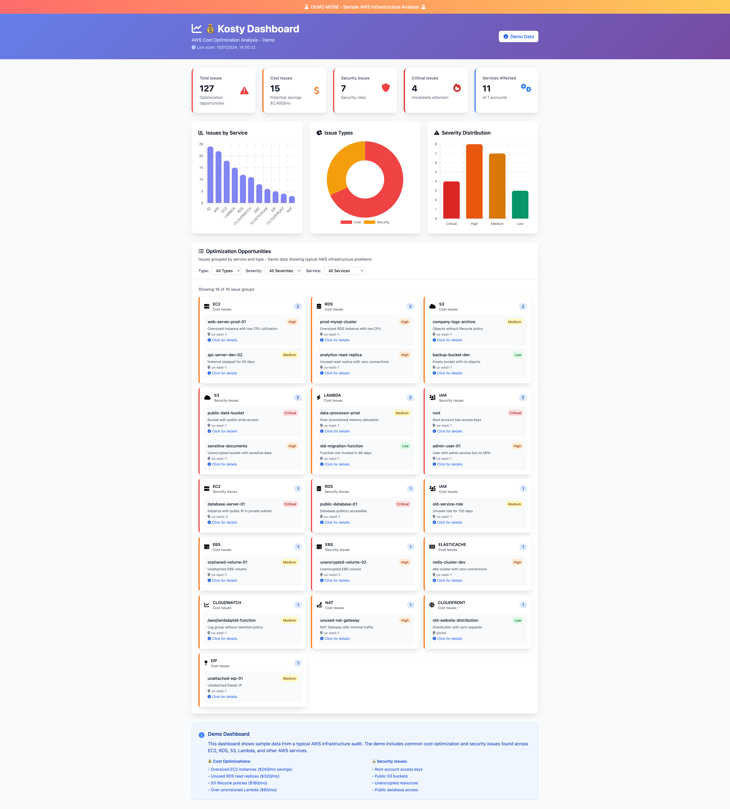

# 💰 Kosty - AWS Cost Optimization & Security Audit CLI Tool

<div align="center">


[](https://python.org)
[](https://aws.amazon.com)
[](LICENSE)

> 💡 Need expert help optimizing your AWS infrastructure? [Professional consulting services available →](https://kosty.cloud?utm_source=github&utm_medium=readme-header)

**🚀 Identify AWS cost waste and security vulnerabilities across 16 core services with a single command**

*Save thousands of dollars monthly and improve security posture by finding unused resources, oversized instances, misconfigurations, and compliance issues*

[🎯 Quick Start](#-quick-start) • [📖 Documentation](docs/DOCUMENTATION.md) • [🔧 Installation](#-installation) • [💡 Examples](#-examples)

## 📊 Visual Dashboard

**Not just CLI!** Kosty includes a beautiful, modern web dashboard to visualize your optimization results:



✨ **Premium Features**: Interactive charts, responsive design, real-time data visualization, and professional reporting.

</div>

---


## 🌟 Built by a Cloud Consultant, for Cloud Engineers

After years of AWS consulting , I kept finding the same costly patterns:
- Load Balancers with no targets  **10K$-30K$/year wasted**
- Orphaned EBS volumes: **$1,000-2,500/year**  
- Unused NAT Gateways, oversized instances, old snapshots,...

**Every. Single. Time.**

So I built Kosty - the tool I wish existed when I started consulting.


### What Kosty Does
- 🔍 Scans **16 core AWS services** in one command
- 💰 **Quantifies cost savings** with real dollar amounts (11 services)
- 📊 Finds **oversized instances** (EC2, RDS, Lambda)
- 🔐 Detects **security vulnerabilities** (public DBs, unencrypted storage, open ports)
- 🛡️ Identifies **compliance issues** (old access keys, public snapshots, weak configurations)

**One command. Full audit. Real savings. Free forever.**

AWS costs and security risks can spiral out of control quickly. Kosty helps you:
- 🔍 **Discover** unused resources and security vulnerabilities across 16 core AWS services
- 💰 **Quantify** cost savings with real dollar amounts ($X/month calculations)
- 🔐 **Detect** security misconfigurations and compliance issues
- ⚡ **Optimize** with prioritized recommendations by financial impact
- 🏢 **Scale** across entire AWS Organizations with parallel processing
- 📊 **Track** ROI with comprehensive cost reporting


## 🎯 Quick Start

```bash
# Install Kosty via pip (recommended)
pip install kosty

# Or install from source
git clone https://github.com/kosty-cloud/kosty.git
cd kosty && ./install.sh

# 🚀 ONE COMMAND TO RULE THEM ALL - Comprehensive scan
kosty audit --output all

# Organization-wide comprehensive scan with reports
kosty audit --organization --max-workers 20 --output all

# Individual service scans
kosty ec2 audit --cpu-threshold 20
kosty rds audit
kosty s3 audit

# Cost and security audits separately
kosty ec2 cost-audit --cpu-threshold 20
kosty s3 security-audit
kosty iam security-audit

# Individual checks
kosty ec2 check-oversized-instances --cpu-threshold 20
kosty ec2 check-stopped-instances --days 7
kosty s3 check-empty-buckets
kosty rds check-public-databases

# 📊 View results in beautiful dashboard
open dashboard/index.html
```

## 🔧 Installation

### Prerequisites
- Python 3.7+
- AWS CLI configured with appropriate credentials

### Quick Install (Recommended)
```bash
pip install kosty
```

### Install from Source
```bash
git clone https://github.com/kosty-cloud/kosty.git
cd kosty
./install.sh
```

### Development Install
```bash
git clone https://github.com/kosty-cloud/kosty.git
cd kosty
pip install -e .
```

## 💡 Examples

### 🏆 High-Impact Optimizations with Cost Savings

```bash
# Find oversized EC2 instances (potential $280/month per m5.2xlarge)
kosty ec2 check-oversized-instances --cpu-threshold 20

# Find oversized RDS instances (potential $700/month per db.r5.4xlarge)
kosty rds check-oversized-instances --cpu-threshold 20

# Find over-provisioned Lambda functions (memory optimization savings)
kosty lambda check-over-provisioned-memory

# Find orphaned EBS volumes (potential $10/month per 100GB)
kosty ebs check-orphan-volumes

# Find unattached Elastic IPs (potential $3.60/month each)
kosty eip check-unattached-eips

# 💰 View total potential savings in dashboard
kosty audit --output json && open dashboard/index.html
```

### 🔍 Resource Discovery & Security Audits

```bash
# Storage optimization & security
kosty s3 check-empty-buckets
kosty s3 check-public-read-access
kosty s3 check-encryption-at-rest
kosty ebs check-orphan-volumes
kosty ebs check-unencrypted-orphan
kosty snapshots check-old-snapshots --days 30
kosty snapshots check-public-snapshots

# Database optimization & security
kosty rds check-oversized-instances --cpu-threshold 20
kosty rds check-public-databases
kosty rds check-unencrypted-storage
kosty dynamodb check-idle-tables

# Network optimization & security
kosty lb check-no-healthy-targets
kosty nat check-unused-gateways
kosty sg check-unused-groups
kosty sg check-overly-permissive

# Security & compliance checks
kosty ec2 check-ssh-open
kosty ec2 check-imdsv1
kosty ec2 check-unencrypted-ebs
kosty iam check-root-access-keys
kosty iam check-unused-roles
kosty iam check-old-access-keys
```

### 🏢 Comprehensive Scanning

```bash
# 🎯 ULTIMATE COST AUDIT - All services, all checks
kosty audit --output all

# Organization-wide comprehensive scan (16 services)
kosty audit --organization --max-workers 20 --output json

# Multi-region comprehensive audit
kosty audit --regions us-east-1,eu-west-1,ap-southeast-1 --output csv

# Single region scan
kosty audit --region eu-west-1 --output json

# Quick console summary
kosty audit --output console

# Generate all report formats
kosty audit --organization --output all --max-workers 15

# 📊 Visualize results in dashboard
kosty audit --output json
open dashboard/index.html  # Upload the JSON file
```

## 🚀 Command Types

Kosty offers **3 types of commands** for maximum flexibility:

### 1. 🎯 **Complete Audits** - Full service analysis
```bash
kosty <service> audit           # Complete audit (cost + security)
kosty ec2 audit                 # All EC2 checks
kosty s3 audit                  # All S3 checks
```

### 2. 💰 **Targeted Audits** - Cost or security focus
```bash
kosty <service> cost-audit      # Cost optimization only
kosty <service> security-audit  # Security issues only

kosty ec2 cost-audit           # EC2 cost issues only
kosty s3 security-audit        # S3 security issues only
kosty iam security-audit       # IAM security issues only
```

### 3. 🔍 **Individual Checks** - Specific issue detection
```bash
kosty <service> check-<issue>   # Specific check

kosty ec2 check-oversized-instances
kosty ec2 check-stopped-instances
kosty s3 check-empty-buckets
kosty rds check-public-databases
kosty iam check-root-access-keys
```

### 4. 🌍 **Multi-Region & Organization** - Comprehensive scanning
```bash
# Multi-region scanning
kosty audit --regions us-east-1,eu-west-1,ap-southeast-1
kosty ec2 audit --regions us-east-1,eu-west-1

# Organization-wide with multi-region
kosty audit --organization --regions us-east-1,eu-west-1 --max-workers 20
kosty s3 check-public-read-access --organization --regions us-east-1,eu-west-1

# Custom cross-account role for organization scanning
kosty audit --organization --cross-account-role MyCustomRole

# Separate organizational admin account
kosty audit --organization --org-admin-account-id 123456789012

# Combined custom role and admin account
kosty audit --organization --cross-account-role MyRole --org-admin-account-id 123456789012
```

---

## 💰 Cost Quantification Engine

### 💵 Services with Cost Calculations (11 Services)

Kosty provides **real monthly and annual savings estimates** for these services:

| Service | Cost Calculation | Example Savings |
|---------|------------------|----------------|
| **EBS** | Orphaned volumes by size & type | $10.00/month (100GB gp2) |
| **EC2** | Stopped instances by type | $280.32/month (m5.2xlarge) |
| **EIP** | Unattached Elastic IPs | $3.60/month (fixed rate) |
| **NAT Gateway** | Unused gateways | $32.85/month (per gateway) |
| **Load Balancer** | ALBs with no targets | $16.43/month (per ALB) |
| **S3** | Lifecycle optimization candidates | $2.30/month (100GB) |
| **Snapshots** | Old EBS snapshots | $5.00/month (100GB) |
| **Backup** | Empty AWS Backup vaults | $0.00/month (no storage) |
| **RDS** | Oversized instances (<20% CPU) | $700.80/month (db.r5.4xlarge) |
| **Lambda** | Over-provisioned memory (>512MB) | $0.68/month (optimization) |
| **DynamoDB** | Idle tables (low RCU/WCU) | Variable (on-demand savings) |

### 📈 Services with Audit Only (5 Services)

These services provide security and compliance audits without cost quantification:
- **IAM**: Security policies, unused roles, compliance
- **CloudWatch**: Log retention, unused alarms
- **Route53**: Unused hosted zones, DNS configuration
- **API Gateway**: Unused APIs, security configuration
- **Security Groups**: Unused groups, overly permissive rules

### ⚠️ Cost Calculation Disclaimer

**Important**: Cost estimates are based on AWS Pricing API and standard on-demand rates. **Actual costs may vary** due to:

- 💰 **Reserved Instance discounts** (up to 75% off)
- 💰 **Savings Plans** (up to 72% off)
- 💰 **Volume discounts** for high usage
- 🌍 **Regional pricing variations**
- 🏢 **Enterprise agreements** and custom pricing
- 📈 **Spot instance pricing** (up to 90% off)
- 🔄 **Free tier limits** and credits

**Use estimates for**:
- ✅ Relative comparison between issues
- ✅ Optimization prioritization
- ✅ Business case development
- ✅ ROI trend analysis

**Verify actual costs** in your AWS billing dashboard before making decisions.

---

## 📊 Complete Service Coverage (16 Services)

### 🎯 Service Overview

| Category | Services | Key Checks |
|----------|----------|------------|
| **💻 Compute** | EC2, Lambda | Oversized instances, unused functions |
| **🗄️ Storage** | S3, EBS, Snapshots | Empty buckets, orphaned volumes, old snapshots |
| **🗃️ Database** | RDS, DynamoDB | Idle databases, over-provisioned tables |
| **🌐 Network** | EIP, LB, NAT, SG, Route53 | Unused resources, no healthy targets |
| **🔐 Security** | IAM | Unused roles, old access keys, inactive users |
| **📊 Management** | CloudWatch, Backup | Unused alarms, expensive logs, empty vaults |
| **🌐 Application** | API Gateway | Unused APIs, expensive configurations |

### 📋 Service Commands Summary

| Service | Total Commands | Audit Types | Individual Checks |
|---------|----------------|-------------|-------------------|
| **EC2** | 16 | 3 | 13 checks |
| **RDS** | 17 | 3 | 14 checks |
| **S3** | 14 | 3 | 11 checks |
| **IAM** | 13 | 3 | 10 checks |
| **EBS** | 12 | 3 | 9 checks |
| **LB** | 10 | 3 | 7 checks |
| **SG** | 9 | 3 | 6 checks |
| **Lambda** | 8 | 3 | 5 checks |
| **EIP** | 7 | 3 | 4 checks |
| **CloudWatch** | 7 | 3 | 4 checks |
| **Backup** | 6 | 3 | 3 checks |
| **NAT** | 6 | 3 | 3 checks |
| **Snapshots** | 6 | 3 | 3 checks |
| **API Gateway** | 5 | 3 | 2 checks |
| **DynamoDB** | 5 | 3 | 2 checks |
| **Route53** | 5 | 3 | 2 checks |

**📊 Total: 147 commands (1 global + 146 service commands)**

### 🔍 Top Individual Checks by Service

**EC2 (13 individual checks):**
- `check-oversized-instances` - Instances with low CPU utilization
- `check-stopped-instances` - Instances stopped for 7+ days
- `check-ssh-open` - SSH port open to 0.0.0.0/0
- `check-idle-instances` - Instances with <5% CPU usage

**S3 (11 individual checks):**
- `check-empty-buckets` - Buckets with no objects
- `check-public-read-access` - Buckets with public read access
- `check-encryption-at-rest` - Unencrypted buckets
- `check-lifecycle-policy` - Buckets needing lifecycle policies

**RDS (14 individual checks):**
- `check-public-databases` - Publicly accessible databases
- `check-oversized-instances` - Over-provisioned RDS instances
- `check-unused-read-replicas` - Unused read replicas
- `check-unencrypted-storage` - Unencrypted RDS storage

**IAM (10 individual checks):**
- `check-root-access-keys` - Root account access keys
- `check-unused-roles` - Roles unused for 90+ days
- `check-inactive-users` - Inactive users with active keys
- `check-wildcard-policies` - Policies with wildcard permissions

## 🎯 The Ultimate Command

```bash
# 🚀 ONE COMMAND TO AUDIT EVERYTHING
kosty audit

# Organization-wide comprehensive audit
kosty audit --organization --max-workers 20

# Generate all report formats
kosty audit --output all
```

**What `kosty audit` does:**
- ✅ **Scans 16 core AWS services** automatically
- ✅ **Runs complete audits** (cost + security) per service
- ✅ **Generates comprehensive reports** (JSON, CSV, Console)
- ✅ **Prioritizes issues** by severity and impact
- ✅ **Scales across** single account or entire organization

## 🚀 Features

### 💻 **CLI + Web Dashboard**
- ✅ **Modular CLI Architecture** - Organized by AWS service for maintainability
- ✅ **Command Line Interface** - Powerful CLI for automation and scripting
- ✅ **Visual Web Dashboard** - Modern React-based interface with interactive charts
- ✅ **Multiple Report Formats** - Console, JSON, CSV outputs + visual reports

### 🔍 **Comprehensive Analysis**
- ✅ **16 Core AWS Services** - Essential infrastructure coverage
- ✅ **Cost Quantification** - Real dollar savings for 11 services
- ✅ **One-Command Audit** - `kosty audit` scans everything
- ✅ **Organization Support** - Multi-account scanning with configurable roles
- ✅ **Multi-Region** - Scan across multiple AWS regions simultaneously with `--regions`
- ✅ **Flexible IAM** - Custom cross-account roles and separate org admin accounts

### ⚡ **Performance & Usability**
- ✅ **Parallel Processing** - High-performance with configurable workers
- ✅ **ROI Prioritization** - Issues ranked by financial impact
- ✅ **Safe Operations** - Read-only analysis, no resource modifications
- ✅ **Professional Reporting** - Executive-ready dashboards with cost totals
- ✅ **Smart Validation** - Upfront permission checks with clear error messages

## 📖 Documentation

- [📋 Complete Documentation](docs/DOCUMENTATION.md)
- [🔧 AWS Credentials Setup](docs/DOCUMENTATION.md#aws-credentials-setup)
- [🏢 Organization Mode Setup](docs/DOCUMENTATION.md#organization-mode)
- [🔐 Cross-Account Role Configuration](docs/DOCUMENTATION.md#cross-account-roles)
- [📊 Visual Dashboard](dashboard/README.md)
- [🏗️ CLI Architecture](docs/CLI_ARCHITECTURE.md)
- [📝 Release Notes](docs/RELEASE_NOTES.md)
- [🛠️ Troubleshooting Guide](docs/DOCUMENTATION.md#troubleshooting)

## 🤝 Contributing

We welcome contributions! Here's how you can help:

1. **🐛 Report Issues** - Found a bug? [Open an issue](https://github.com/kosty-cloud/kosty/issues)
2. **💡 Feature Requests** - Have an idea? [Start a discussion](https://github.com/kosty-cloud/kosty/discussions)
3. **🔧 Add Services** - Implement new AWS service checks
4. **📖 Improve Docs** - Help make documentation better
5. **⭐ Star the Repo** - Show your support!

### Adding New Services

```python
# kosty/services/new_service_audit.py
import boto3
from typing import List, Dict, Any

class NewServiceAuditService:
    def __init__(self):
        self.cost_checks = ['check_unused_resources']
        self.security_checks = ['check_public_access']
    
    def audit(self, session: boto3.Session, region: str, **kwargs) -> List[Dict[str, Any]]:
        results = []
        results.extend(self.cost_audit(session, region, **kwargs))
        results.extend(self.security_audit(session, region, **kwargs))
        return results
```

## 📄 License

This project is licensed under the MIT License - see the [LICENSE](LICENSE) file for details.

---

## 💼 Professional Services

Kosty is free and open-source for self-service optimization. For teams who prefer expert guidance to maximize results and ensure safe implementation, I offer professional audits.

### What's Included

**Comprehensive AWS Cost & Security Audit**
- Full Kosty scan across all accounts and regions + manual architecture review
- Prioritized optimization roadmap ranked by ROI, effort, and risk
- Security vulnerability assessment (public databases, old IAM keys, overly permissive security groups)
- Implementation guidance and team training

**Typical Results:**
- €1K-30K/year in cost savings (most clients)
- Critical security gaps identified and resolved
- 2-7 day delivery depending on complexity
- Money-back guarantee if savings don't exceed the audit cost

### Pricing

| Tier | AWS Spend | Price | Timeline | What's Included |
|------|-----------|-------|----------|------------------|
| **Startup** | <€2K/mo | €500 | 2-3 days | Full scan, action plan, 30-min call, 2 weeks email support |
| **Growth** | €2-10K/mo | €1,500 | 3-5 days | Multi-account analysis, detailed roadmap, security report, 1-hour call, Slack support, 30-day follow-up |
| **Scale** | €10K+/mo | Custom | Custom | Everything in Growth + architecture deep-dive, team training, implementation support, quarterly check-ins |

### Why Work With Me?

- Built Kosty after 9 years of AWS consulting (seen the same waste patterns repeatedly)
- AWS specialist and FinOps
- Engineer-to-engineer approach: honest technical advice, no sales BS

### Get Started

**Free 30-minute assessment:** Book a no-commitment call to discuss your AWS setup and whether an audit makes sense.

📅 **Calendar:** https://calendly.com/consulting-kosty/30min  
📧 **Email:** yassir@kosty.cloud  
🌐 **Website:** https://kosty.cloud?utm_source=github&utm_medium=readme-section

---

## ⭐ Show Your Support

If Kosty helped you save money on AWS costs, please:

- ⭐ **Star this repository**
- 🐦 **Share on Twitter** with #AWSCostOptimization
- 💬 **Tell your colleagues** about cost optimization
- 🤝 **Contribute** to make it even better

---

<div align="center">

**💰 Save money. Optimize AWS. Scale efficiently.**

[🎯 Get Started](#-quick-start) • [📖 Documentation](docs/DOCUMENTATION.md) • [🤝 Contribute](#-contributing)

</div>
