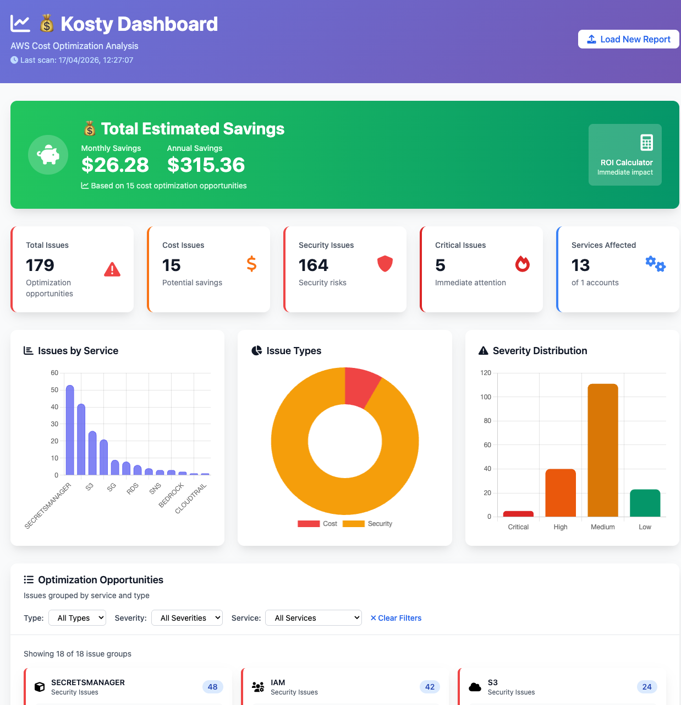
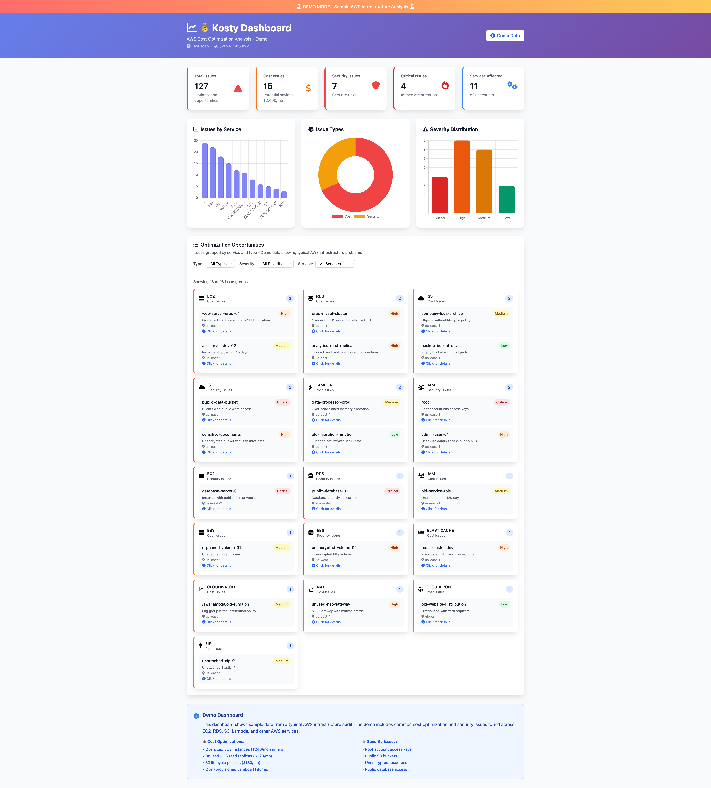
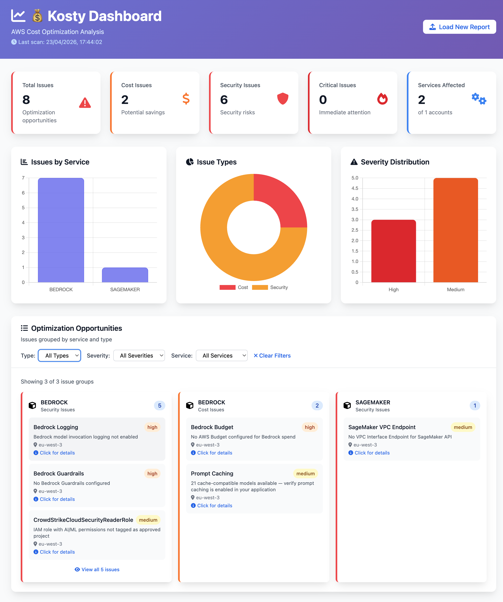

# 💰 Kosty - AWS Cost Optimization & Security Audit CLI Tool

<div align="center">


[](https://python.org)
[](https://aws.amazon.com)
[](LICENSE)

> 🤖 **New in v2.0.0** — `kosty ai` now audits Bedrock and SageMaker workloads: guardrails, shadow AI detection, idle GPU endpoints, prompt caching, and more. [See what's new →](docs/RELEASE_NOTES.md)

**Scan 30+ AWS services. Find cost waste. Detect security gaps. Audit GenAI workloads. One command.**

[Quick Start](#-quick-start) • [Key Features](#-key-features) • [Service Coverage](#-service-coverage) • [Documentation](docs/DOCUMENTATION.md)

</div>

---

## ⚡ Why Kosty

🌐 **External Attack Surface Mapping** — scan 15 resource types, classify exposure as unprotected / partially protected / protected

🔐 **IAM Privilege Escalation Detection** — 21 known escalation patterns with optional `--deep` confirmation via SimulatePrincipalPolicy

🤖 **GenAI Security & Cost Audit** — Bedrock guardrails, shadow AI detection, SageMaker idle GPU endpoints, prompt caching

🏢 **Organization-Wide Scanning** — parallel audit across hundreds of AWS accounts with cross-account role assumption

🛡️ **200+ Security Checks** — WAF hardening, API Gateway auth/throttling/TLS, CloudTrail, GuardDuty, VPC Flow Logs, KMS rotation

💰 **Real Dollar Savings** — not just recommendations, actual monthly amounts for 11 services ($280/mo per stopped m5.2xlarge, $700/mo per oversized db.r5.4xlarge)

---

## 🎯 Quick Start

```bash
pip install kosty

# Full audit — cost + security across 30+ services
kosty audit --output all

# External attack surface mapping
kosty public-exposure --output console

# AI/ML audit — Bedrock + SageMaker
kosty ai audit --output console

# IAM privilege escalation detection (21 patterns)
kosty iam check-privilege-escalation --deep

# Organization-wide scan
kosty audit --organization --max-workers 20 --output all
```

> 💡 Need expert help? [Professional consulting available →](https://kosty.cloud?utm_source=github&utm_medium=readme)

---

## 📊 Visual Dashboard



<table>
<tr>
<td></td>
<td></td>
</tr>
<tr>
<td align="center"><em>Full Audit Dashboard</em></td>
<td align="center"><em>AI/ML Audit Dashboard</em></td>
</tr>
</table>

Upload your JSON report to the built-in dashboard for interactive charts, filtering, and cost breakdowns.

---

## 🚀 Key Features

### 🌐 Attack Surface Mapping

Map everything publicly exposed and evaluate protections — ALB, EC2, S3, RDS, API Gateway, Lambda URLs, CloudFront, OpenSearch, Redshift, EKS, ECR, SNS, SQS, and snapshots.

```bash
kosty public-exposure --output console
```

Each finding is classified:
- 🔴 **Exposed & Unprotected** — no protections, immediate action
- 🟡 **Exposed & Partially Protected** — gaps remain
- 🟢 **Exposed & Protected** — all protections verified

### 🔐 Security Audit

200+ checks across 30+ services. Highlights:

- **IAM Privilege Escalation** — detects 21 known escalation patterns with optional `--deep` confirmation via SimulatePrincipalPolicy
- **WAF Hardening** — managed rules, rate limiting, bot control, logging, action mode
- **API Gateway** — WAF association, authorization, throttling, TLS 1.2, CloudFront bypass detection, request validation
- **Foundational** — CloudTrail, VPC Flow Logs, GuardDuty, AWS Config, KMS key rotation
- **Data Protection** — S3 encryption, RDS encryption, ElastiCache encryption, Secrets Manager rotation

```bash
kosty iam security-audit --deep
kosty waf audit
kosty apigateway security-audit
```

### 🤖 AI/ML Audit

Dedicated `kosty ai` command for Bedrock and SageMaker workloads. Catches the invisible waste and security gaps that standard audits miss.

```bash
kosty ai audit                              # full Bedrock + SageMaker
kosty ai bedrock check-no-guardrails        # prompt injection protection
kosty ai bedrock check-shadow-ai            # unapproved AI usage
kosty ai sagemaker check-idle-endpoints     # GPU instances burning cash
```

**Bedrock** (12 checks) — guardrails, shadow AI detection, VPC endpoints, prompt caching, inference profiles, custom model encryption, logging, budget limits, TPM quota monitoring, cross-account model access, model sizing analysis, batch eligibility detection

**SageMaker** (8 checks) — idle endpoints, zombie notebooks, Spot training, checkpointing, Inference Components, VPC endpoints, internet access, root access

### 💰 Cost Optimization

Real dollar savings for 11 services — not just recommendations, actual monthly amounts:

| Finding | Typical Savings |
|---------|----------------|
| Stopped EC2 instances | $280/mo per m5.2xlarge |
| Oversized RDS instances | $700/mo per db.r5.4xlarge |
| Unused NAT Gateways | $33/mo each |
| Orphaned EBS volumes | $10/mo per 100GB |
| Load Balancers with no targets | $16/mo each |
| Unused secrets | $0.40/mo each |

```bash
kosty audit --output json   # generates report with $ amounts
open dashboard/index.html   # visualize savings
```

---

## 📊 Service Coverage

**30 services**, organized by category:

| Category | Services | Key Checks |
|----------|----------|------------|
| **Compute** | EC2, Lambda | Oversized, idle, IMDSv1, outdated runtimes |
| **Storage** | S3, EBS, Snapshots | Public access, encryption, lifecycle, object lock |
| **Database** | RDS, DynamoDB | Public DBs, oversized, encryption, backups |
| **Network** | EIP, LB, NAT, SG, Route53, VPC | Unused resources, open ports, flow logs |
| **Security** | IAM, WAFv2, GuardDuty, KMS | Privilege escalation, MFA, key rotation, threat detection |
| **Management** | CloudWatch, Backup, CloudTrail, Config | Logging, audit trail, drift detection |
| **Application** | API Gateway | WAF, auth, throttling, TLS, CloudFront bypass |
| **AI/ML** | Bedrock, SageMaker | Guardrails, shadow AI, idle endpoints, prompt caching, VPC endpoints |
| **Secrets** | Secrets Manager | Unused secrets, rotation |
| **Messaging** | SNS, SQS | Encryption at rest and in transit |
| **Cache** | ElastiCache | Encryption at rest and in transit |
| **Certificates** | ACM | Expiring certificates |
| **Containers** | ECS | Privileged task definitions |
| **Patch Mgmt** | SSM | Patch compliance |

Full check list per service → [docs/SERVICES.md](docs/SERVICES.md)

---

## 🔧 Installation

```bash
# PyPI (recommended)
pip install kosty

# Docker
docker run --rm -v ~/.aws:/home/nonroot/.aws:ro ghcr.io/kosty-cloud/kosty:latest audit

# From source
git clone https://github.com/kosty-cloud/kosty.git && cd kosty && pip install -e .
```

---

## ⚙️ Configuration

```yaml
# kosty.yaml
default:
  regions: [us-east-1, eu-west-1]
  max_workers: 20

exclude:
  services: [route53]
  tags:
    - key: "kosty_ignore"
      value: "true"

profiles:
  production:
    role_arn: "arn:aws:iam::123456789012:role/AuditRole"
    regions: [us-east-1]
  staging:
    aws_profile: "staging-profile"
    regions: [eu-west-1]
```

```bash
kosty audit --profile production
kosty audit --profiles --output all    # all profiles in parallel
```

Full configuration guide → [docs/CONFIGURATION.md](docs/CONFIGURATION.md)

---

## 📖 Documentation

| Guide | Description |
|-------|-------------|
| [Full Documentation](docs/DOCUMENTATION.md) | Complete user guide |
| [Service Coverage](docs/SERVICES.md) | All 30 services and their checks |
| [CLI Reference](docs/CLI_REFERENCE.md) | Every command and option |
| [Examples](docs/EXAMPLES.md) | Detailed usage examples |
| [Configuration](docs/CONFIGURATION.md) | YAML config, profiles, exclusions |
| [Multi-Profile Guide](docs/MULTI_PROFILE_GUIDE.md) | Parallel multi-customer audits |
| [Release Notes](docs/RELEASE_NOTES.md) | Version history |

---

## 🤝 Contributing

1. **Report Issues** — [Open an issue](https://github.com/kosty-cloud/kosty/issues)
2. **Add Services** — Follow the pattern in `kosty/services/`
3. **Star the Repo** — Show your support

---

## 💼 Professional Services

Free 30-minute assessment to discuss your AWS setup.

📅 [Book a call](https://calendly.com/consulting-kosty/30min) · 📧 yassir@kosty.cloud · 🌐 [kosty.cloud](https://kosty.cloud?utm_source=github&utm_medium=readme)

---

## 📄 License

MIT License — see [LICENSE](LICENSE)

<div align="center">

**💰 Save money. Secure infrastructure. Ship faster.**

⭐ Star this repo if Kosty saved you money

</div>
